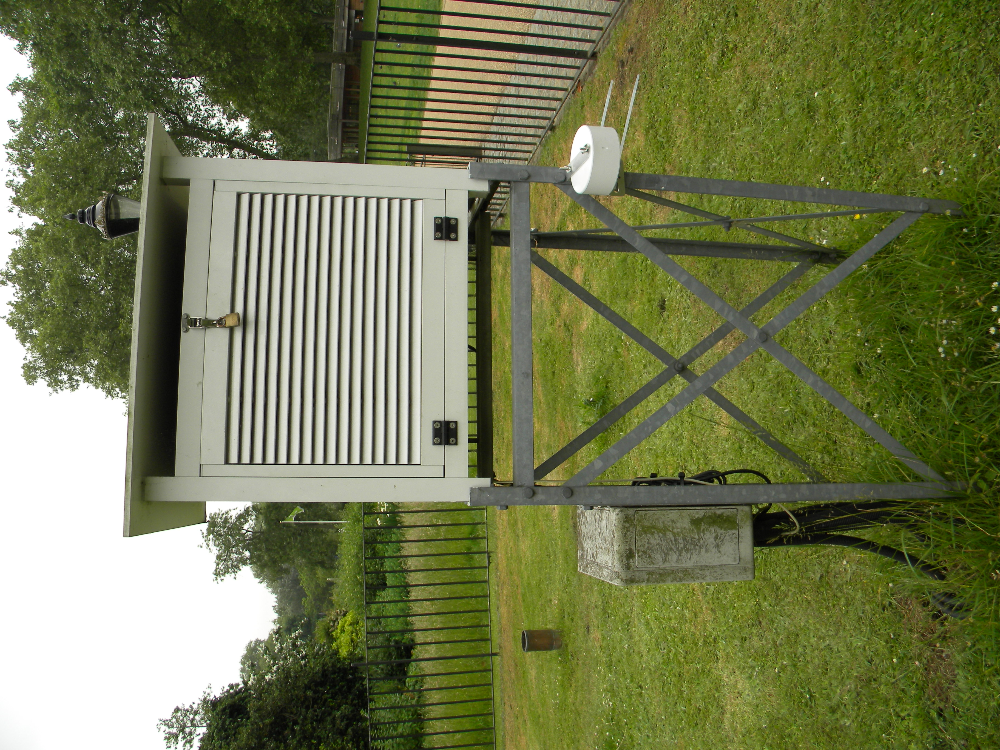

.. _SJP:

***
SJP
***

Introduction
############

.. include:: intros/SJP_intro.rst

Site metadata
#############

.. csv-table:: 
   :file: meta/SJP_meta.csv
   :stub-columns: 1

.. raw:: html

   

   

    

Deployments at site
###################

.. csv-table:: All site deployments
   :file: deployments/dates/SJP_deployment_dates.csv
   :header-rows: 2

.. csv-table:: Position of deployments
   :file: deployments/positions/SJP_deployment_positions.csv
   :header-rows: 2

Photos
######

   Weather station at SJP 10-06-2010.

Data acquisition
################

.. include:: ../../../data_acquisition/data_acquisition_default.rst

References
##########

#. Hertwig, D., Ng, M., Grimmond, S., Vidale, P. L. and McGuire, P. C. (2021) High-resolution global climate simulations: representation of cities. International Journal of Climatology. ISSN 0899-8418 doi: https://doi.org/10.1002/joc.7018

